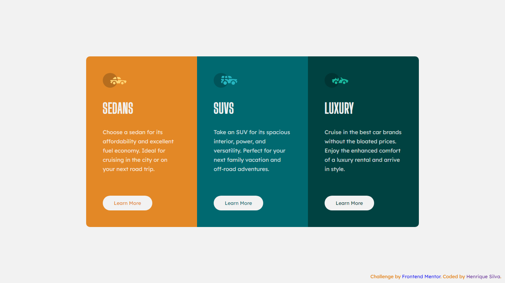

# Frontend Mentor - solução de componente de cartão de visualização de 3 colunas

Esta é uma solução para o [desafio do componente de cartão de visualização de 3 colunas no Frontend Mentor](https://www.frontendmentor.io/challenges/3column-preview-card-component-pH92eAR2-). Os desafios do Frontend Mentor ajudam você a melhorar suas habilidades de codificação criando projetos realistas.

## Índice

- [Visão geral](#visão-geral)
  - [O desafio](#the-challenge)
  - [Captura de tela](#captura-de-tela)
  - [Links](#links)
- [Meu processo](#meu-processo)
  - [Construído com](#construído-com)
  - [O que aprendi](#o-que-aprendi)
  - [Desenvolvimento contínuo](#desenvolvimento-contínuo)
  - [Recursos úteis](#useful-resources)
- [Autor](#autor)
- [Agradecimentos](#agradecimentos)


## Visão geral

### O desafio

Os usuários devem ser capazes de:

- Visualize o layout ideal dependendo do tamanho da tela do dispositivo
- Veja os estados de foco para elementos interativos

### Captura de tela




### Links

- URL da solução: [Site da solução](https://your-solution-url.com)
- URL do site ao vivo: [Site ao vivo](https://your-live-site-url.com)

## Meu processo

### Construído com

- Marcação HTML5 semântica
- Propriedades personalizadas de CSS
- Flexbox

### O que eu aprendi

Neste projeto foi melhorado as habilidades de css, tendo ênfase na propriedade flex, Footer e em como deixar uma página responsiva.

``` css
@media screen and (max-width :780px){
    .conteiner{
        flex-direction: column;
    }
}
```

### Desenvolvimento contínuo

Para desenvolvimento contínuo pretendo continuar aperfeiçoando meus conhecimentos em css e começar a estudar JavaScript.

### Recursos úteis

- [Cards responsivos](https://www.youtube.com/watch?v=_-3nHZHkn4M) - Esse video me ajudou a enteder como deixava o meu projeto responsivo.
- [Bordas de cards](https://www.infowester.com/css3bordas.php#:~:text=Para%20declarar%20as%20bordas%20separadamente,para%20o%20canto%20inferior%20direito) - Este é um artigo incrível que me ajudou a enteder como coloca bordas redondas em apenas um lado. Eu recomendo para quem ainda está aprendendo este conceito.
- [Footer](https://pt.stackoverflow.com/questions/165214/footer-no-final-do-documento) - Esse artigo me ajudou a enteder como estilizava o meu footer.

## Autor

- Site - [Henrique Silva](https://profilehs.netlify.app/)
- Mentor de frontend - [@byhenriquesilva](https://www.frontendmentor.io/profile/byhenriquesilva)
- Github - [@byhenriquesilva](https://github.com/byhenriquesilva)

## Agradecimentos

Agradecer primeiramente a Deus, agradecer a Frontend Mentor por essa oportunidade de praticar e melhorar minnhas habilidades e agradecer a todos que me ejudaram e me apoiaram na  construção desse projeto.
